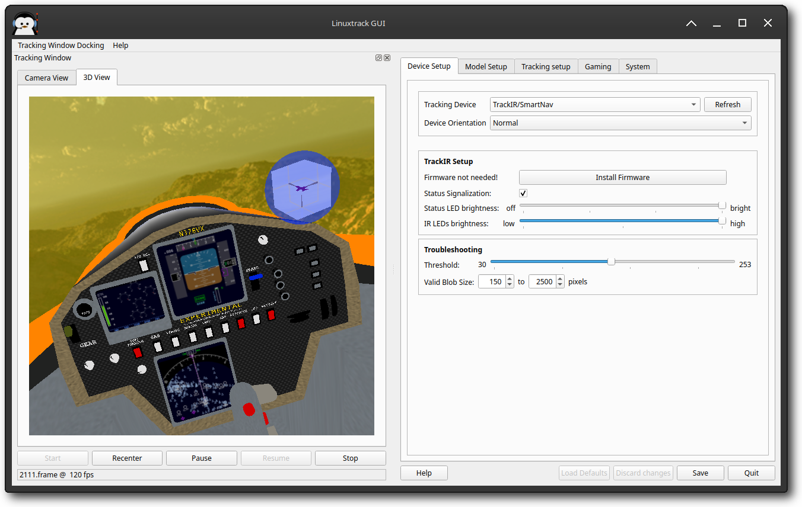
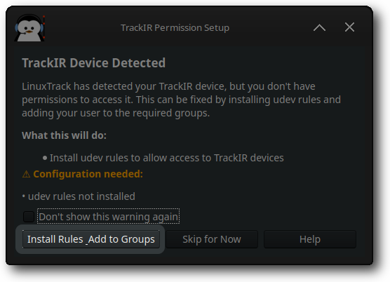
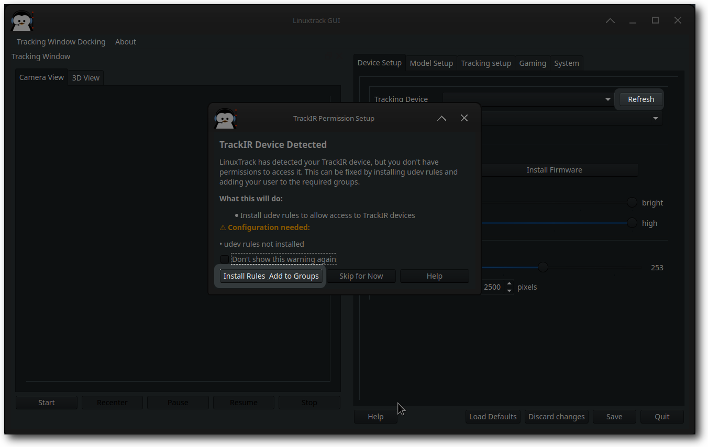
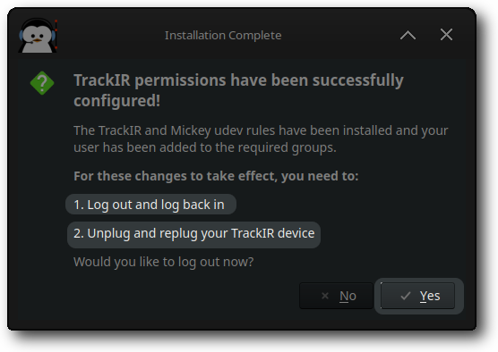
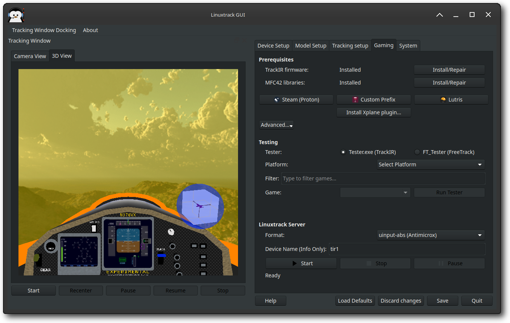
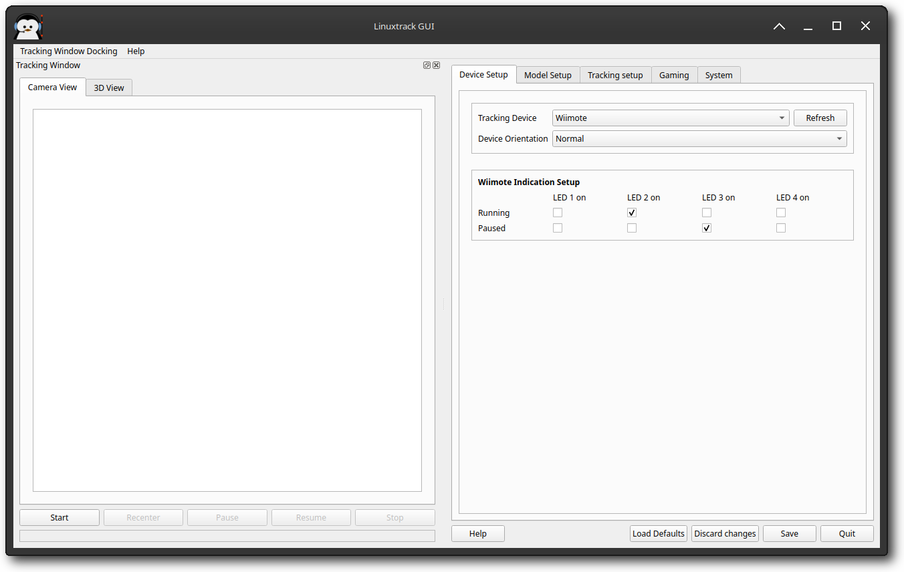
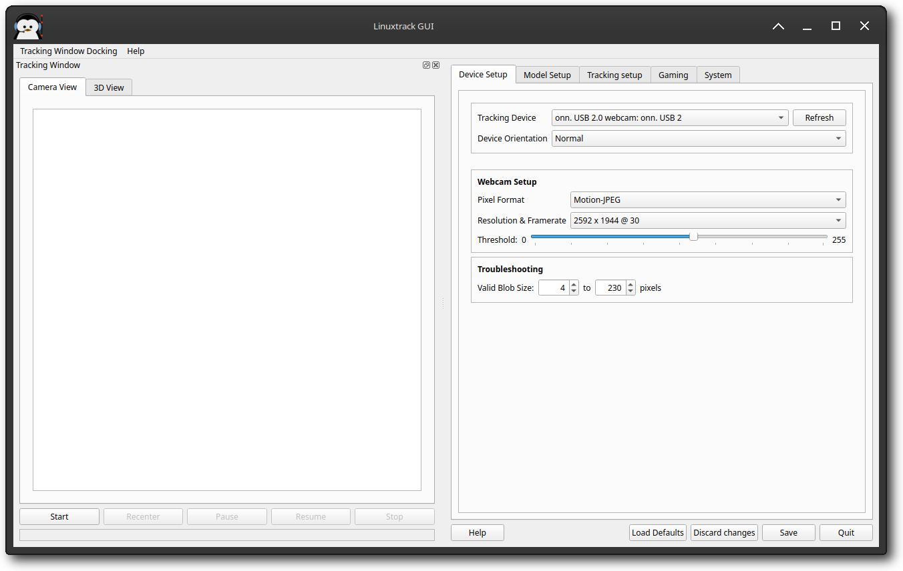
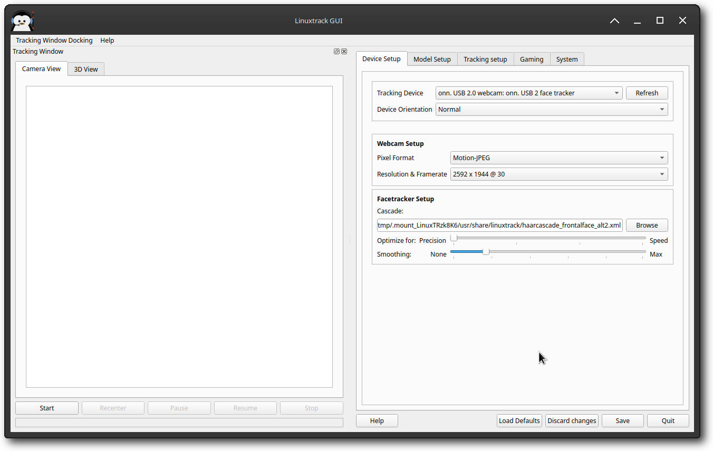
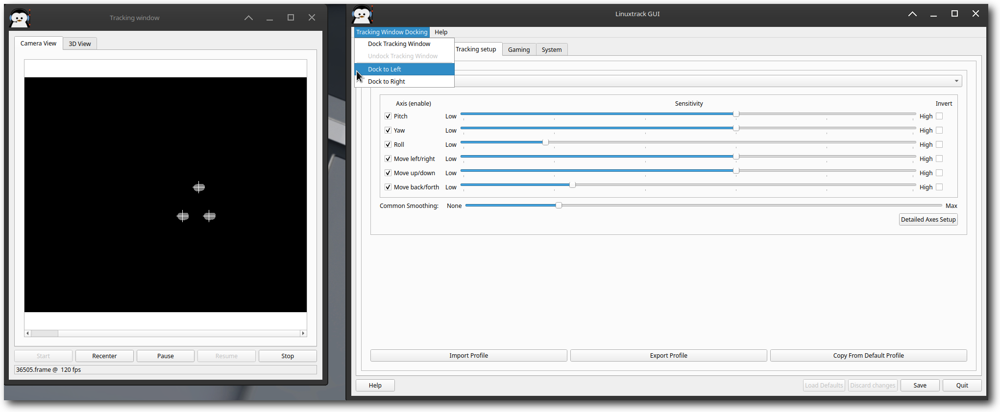

# Linuxtrack X-IR - Tracker Setup

The first step in Linuxtrack configuration is selection of the tracking device.
Select the device of your choice from the "**Tracking device**" combo box and the device
specific options appear below.

If you can't find the device you want to use (e.g. web-cam attached after Linuxtrack GUI was started, ...),
press the "**Refresh**" button and check again.

Next thing that you can set is the camera orientation - normally you should not need to change this...
However, if your tracking device is positioned in any other way than in front of you with top pointing up
(you mounted TrackIR upside down for some reason, or you use laptop with a web-cam chip mounted upside down,...),
change the **Camera Orientation** to match your device's orientation.

Supported device types are the following:

[TrackIR Setup (including SmartNav devices)](#trackir-setup-including-smartnav-devices)
[HID device setup](#hid-device-setup)
[Wiimote Setup](#wiimote-setup)
[Web-cam Setup](#web-cam-setup)
[Web-cam Setup for face tracking](#web-cam-setup-for-face-tracking)

## TrackIR/SmartNav Setup

*TrackIR setup.*


When you intend to use TrackIR on Linux, most probably you'll need to get access rights to the device.
The easiest way to do that, is to install the 99-TIR.rules file (comes with LinuxTrack X-IR) to the udev rules
directory (on Ubuntu it is /lib/udev/rules, but other distros might differ a bit in this respect).
When the rule is there, just re-plug the TrackIR and you should be able to access it.

## TrackIR Permission Setup

When using TrackIR devices with LinuxTrack X-IR on Linux, you need to install udev rules to grant your user account permission to access the TrackIR hardware. This guide explains the permission installation process and troubleshooting steps.

### Initial Permission Setup

The first time you start LinuxTrack X-IR with a TrackIR device connected, you'll see a permission setup dialog if the required udev rules are not installed.



This dialog appears when:

- TrackIR device is detected by LinuxTrack X-IR

- udev rules for TrackIR access are not installed

- Your user account is not in the required groups

To proceed with the installation:

1. Click **"Install Rules & Add to Groups"** (the highlighted button)
2. Enter your sudo password when prompted
3. Wait for the installation to complete

### Permission Setup After Refresh

If you start LinuxTrack X-IR without a TrackIR device connected and then plug it in later, you can trigger the permission setup by clicking the **"Refresh"** button in the Device Setup tab.



This will show the same permission setup dialog, allowing you to install the required udev rules and add your user to the necessary groups.

### Completing the Installation

After successfully installing the TrackIR permissions, you'll see a completion dialog with important next steps.



The installation process will:

- Install udev rules for TrackIR and Mickey devices

- Add your user account to the required groups

- Configure system permissions for hardware access

### Required Actions After Installation

For the permission changes to take effect, you must:

1. **Log out and log back in** to refresh your user group memberships
2. **Unplug and replug your TrackIR device** to trigger the new udev rules

You can choose to log out immediately by clicking **"Yes"** in the completion dialog, or click **"No"** to log out manually later.

### Troubleshooting

If the permission setup dialog appears again after completing the installation and following the required steps, try these troubleshooting steps:

#### Step 1: Verify Installation

Check if the udev rules were installed correctly:

```
ls -la /lib/udev/rules.d/99-TIR.rules
ls -la /lib/udev/rules.d/99-Mickey.rules
```

#### Step 2: Check Group Membership

Verify your user is in the required groups:

```
groups $USER
```

You should see groups like `input`, `plugdev`, or similar hardware access groups.

#### Step 3: Reboot System

If the permission dialog continues to appear after logging out and back in, try rebooting your system:

1. Save any open work
2. Reboot your computer
3. After reboot, start LinuxTrack X-IR
4. Connect your TrackIR device

#### Step 4: Manual Installation

If automatic installation fails, you can install the udev rules manually:

```
sudo cp 99-TIR.rules /lib/udev/rules.d/
sudo cp 99-Mickey.rules /lib/udev/rules.d/
sudo udevadm control --reload-rules
sudo udevadm trigger
```

### What the Installation Does

The TrackIR permission installation process:

- **Installs udev rules** that allow your user account to access TrackIR hardware

- **Adds your user to hardware groups** required for USB device access

- **Configures system permissions** for head tracking devices

- **Enables automatic device detection** when TrackIR is connected

Once properly installed, you won't see the permission setup dialog again, and your TrackIR device will work seamlessly with LinuxTrack X-IR.

[Now you can try to start the tracking to verify the device is set up correctly.](#starting-the-tracking-for-the-first-time)

## Gaming Platform Integration Setup



LinuxTrack X-IR v0.99.22+ includes comprehensive gaming platform integration for seamless Wine Bridge installation across different gaming platforms. The new Gaming tab provides centralized access to all gaming-related functionality.

For detailed instructions on setting up TrackIR firmware and Wine integration, see the [TrackIR Firmware/Wine Integration Setup](extractor "TrackIR Firmware/Wine Integration Setup") guide.

### Prerequisites for Wine Bridge

Before setting up Wine Bridge integration, ensure you have the following prerequisites:

- **TrackIR Firmware**: Must be installed for Wine Bridge to function properly

- **MFC42.dll**: Required for Windows games compatibility (automatically handled by the installer)

The Gaming tab shows live status of these prerequisites and provides one-click installation/repair options when needed.

### Steam Proton Integration

LinuxTrack X-IR automatically detects Steam installations and Proton versions, including:

- Native Steam installations

- Steam Flatpak installations

- Multiple Proton versions (including beta versions like Proton 9.0 Beta)

- Custom Proton installations

To set up Wine Bridge for Steam games:

1. Navigate to the **Gaming** tab
2. Ensure prerequisites are met (firmware + MFC42)
3. Select **Steam** from the installer targets
4. Click **Install Wine Bridge**
5. The system will automatically detect your Steam installation and install Wine Bridge to the appropriate location

### Lutris Integration

LinuxTrack X-IR provides complete Lutris integration with:

- Automatic Lutris prefix detection

- Support for custom Wine runners

- Flatpak Lutris support

- Enhanced Wine path resolution

To set up Wine Bridge for Lutris games:

1. Navigate to the **Gaming** tab
2. Ensure prerequisites are met
3. Select **Lutris** from the installer targets
4. Click **Install Wine Bridge**
5. The system will detect your Lutris installation and Wine prefixes automatically

### Custom Wine Prefix Setup

For custom Wine prefixes not managed by Steam or Lutris:

1. Navigate to the **Gaming** tab
2. Click **Advanced** menu button
3. Select **Other Platform/Wine Prefix**
4. Choose your custom Wine prefix location
5. Click **Install Wine Bridge**

### Testing Wine Bridge Installation

The Gaming tab includes comprehensive testing functionality:

- **Auto-load Games**: Automatically discovers games in your Steam/Lutris libraries

- **Status Labels**: Shows real-time status of Wine Bridge components

- **Filter Options**: Filter games by platform for easier testing

- **Persistent Settings**: Remembers your last selected platform and game

To test Wine Bridge installation:

1. Ensure Wine Bridge is installed for your target platform
2. Navigate to the **Gaming** tab
3. Click **Test Wine Bridge**
4. Select a game from the list
5. Launch the game to verify head tracking works

### Cross-Distribution Compatibility

LinuxTrack X-IR v0.99.22+ includes enhanced cross-distribution support:

- **Ubuntu/Debian/MX Linux**: Optimized Wine installation with winetricks integration

- **Fedora/Nobara**: Automatic package detection and configuration

- **Arch Linux**: Enhanced Wine32 alternative sources and optimized builds

- **Flatpak Support**: Seamless integration with sandboxed gaming platforms

## HID device setup

Linuxtrack allows you to use a HID device (joystick, ED tracker, ...) as a source of headtracking information
(at the moment Linux only).
Select the device you intend to use in the **Tracking Device** combobox. You'll probably be presented with
a warning message that you need to use the Absolute model; in that case head to the **Model Setup** pane,
select the Absolute model in the **Model Name** combobox and head back to the **Device Setup** pane.
You can also select an interface to use for communication with the device. Of the two possibilities (Evdev/Joystick),
probably the Evdev is a beeter choice, where possible. The reason is, that evdev provides raw data from the device,
which can be used directly; the joystick interface is dependent on the proper calibration using the jscal command
(or some GUI equivalent) - without it the device might be off center and not using the full range of available motion.

Now you can select the device axes to use for each of available six head rotations/movements. The easiest way
is to start the tracking by pressing the **Start** button in the Tracking window and switch to the **3D View**.
Go back to the **Device Setup** and in the **Pitch** combo select one of the available axes; now wiggle all the
device axes and see which one will control the pitch in the **3D View**. If the active axis was intended for
different rotation/movement, then select it as a source for the appropriate rotation/movement. If the axis works
"backwards", go to the **Tracking Setup** pane and check the **Invert** checkbox for the rotation/movment in
question. In the **3D View** confirm that the axis work as expected and move to the next one.

When done with axes setup, you can jump to the [Tracking Setup](axes_setup "Tracking Setup") chapter.

## Wiimote Setup



If Wiimote is the tracking device of your choice, first of all, make sure you have the Wiimote
server running (comes along with Linuxtrack) and connected to the Wiimote.

If Wiimote server is not running, then start it, press the **Connect** button and then
simultaneously press buttons "1" and "2" on the Wiimote . After a short pause, you should see the
state change to Connected and one of LEDs on your Wiimote should blink briefly about every 5 seconds.

Due to the nature of Wiimote there is no way to tweak any parameters except for which LEDs should indicate
running/paused tracker. Just select which LEDs should be on in the Running state and which should be on in
the Paused state. However, if the battery life is crucial for you, you should turn all LEDs off at least in the
Running state (in this state you are going to spend most of the time after all).

[Now you can try to start the tracking to verify the device is set up correctly.](#starting-the-tracking-for-the-first-time)

## Web-cam Setup



To configure a web-cam, first of all you have to set the **Pixel Format**.
The preferred format is YUYV (native UVC web-cam format), but you can experiment and see
which one works the best for you (just avoid the JPEG/MJPG formats as they aren't supported).

Continue by selecting the desired **Resolution & Frame rate**.
The safest bet would be something around 352x288@30; when tracking with these setting works, you can
experiment with different resolutions and frame rates.

To ensure best frame rate (stable and high), it is recommended to turn at least the Automatic exposure off
(better turn off the rest of Auto... features too), if possible.
Then set the exposure manually and tweak the rest of parameters (brightness, contrast, ...) to get good picture.
On Linux you can use the guvcview for this purpose.

[Now you can try to start the tracking to verify the device is set up correctly.](#starting-the-tracking-for-the-first-time)

## Web-cam Setup for face tracking



To configure a web-cam, first of all you have to set the **Pixel Format**.
The preferred format is YUYV (native UVC web-cam format), but you can experiment and see
which one works the best for you (just avoid the JPEG/MJPG formats as they aren't supported).

Continue by selecting the desired **Resolution & Frame rate**.
The safest bet would be something around 352x288@30; when tracking with these setting works, you can
experiment with different resolutions and frame rates.

The last thing to set before the first test is the path to the cascade used to track the face.
OpenCV Haar and LBP cascades are supported.
If the default cascade doesn't suit you, just browse to the cascade of your choice. On Linux you can
find them in the following paths:

- Mac: just press **Open** button and choose- Linux: **/opt/linuxtrack-X.X.X/share/OpenCV** (if you use universal package)
  - Linux: **/usr/share/doc/opencv** (your distro's package)
  - Linux: **/usr/share/doc/opencv-doc** (your distro's package)
  - **http://alereimondo.no-ip.org/OpenCV/34**

You should choose a frontal face detection cascade. If you are short on CPU power, try the LBP cascade
**lbpcascade\_frontalface.xml** - it consumes much less CPU, but the tracking is said to be a bit
less reliable. Just try it out and see how does it work for you.
[Now you can try to start the tracking to verify the device is set up correctly.](#starting-the-tracking-for-the-first-time)

## Starting the tracking for the first time



To start the tracking, switch to the **Tracking window**.
There you can start, pause and stop the tracking and there is a button to recenter the tracker
(needed when your view is off while looking to the center of the screen).
It also contains the frame counter and FPS indication towards the bottom left corner of the window.

There are two panes in this window, the first pane being the **Camera View**.
This pane allows you to troubleshoot the tracking - it shows exactly what the camera sees,
so it can show you for example any interfering light sources, unwanted reflections and so on.
The second pane, **3D view** shows what the result is going to look like in the simulator.

To start the tracking, all you have to do is press the **Start** button and wait for the
device to initialize (usually takes couple of seconds).

In case of head tracking, you should see your head in the **Camera View** pane, with a
white rectangle around it, or in case of model based tracking there should be 3
(or 1 in case of single point model) "blobs" (fields of bright pixels), each of which
has a white cross inside (means a valid blob). You should check, that the rectangles/blobs with crosses are
there through the full range of motions you plan to use.

## Troubleshooting the tracking

When there are any problems with tracking, always look at the **Camera View** first, to check
if there aren't any interferences or other visible problems.

Some devices allow you to do some "post-processing" steps
to discriminate some of the interferences, but the first rule of troubleshooting is this: the best way to get
rid of the interference is to remove it physically.

- A light bulb in the field of view of your camera - the best way is to move the camera in
  such a way, that the bulb gets out of the camera's field of view.

  With infrared sensitive devices (TrackIR/SmartNav, Wiimote, ...) the interference sources might not be all that easily identifiable - things like light bulbs, lit cigars, candles, IR TV and other remote controls can cause considerable interference. Also sun can cause significant problems - not only direct sun, but also areas lit (and heated) by sun can be sources of severe interference.- When using reflective markers (like TrackClip, primarily with TrackIR/SmartNav), there can be reflections from ones glasses or other reflective areas - there the solution might be to use a TrackClip Pro, or similar active "model", as it allows to turn off TrackIR's infra red LEDs.- Face tracking can be fooled easily by visually nonuniform background - having a plain color wall behind you
      is the best way to ensure smooth tracking.

When such a solution is not possible, different devices have different means that might help you to achieve
better tracking results.

### Wiimote

Unfortunately Wiimote doesn't allow any tweaking, as the whole image processing is done in the device
itself. So the only way to deal with problems is to use the advice above and physically remove the interfering
objects from sensor's field of view.

### Web-cam and TrackIR

Both web-cam and TrackIR share similar means of getting rid of sources of interference. The first of them
is the threshold setup - when there are for example some unwanted reflections in camera's field of view,
try to set the threshold somewhat higher; if the unwanted blobs disappeared, then check that the correct blobs
have the white crosses inside them through the whole range of motion you intend to use. If the wanted blob
or the cross inside it disappears, you need to set the threshold somewhat lower.

Another way to discriminate the "bad" blobs is according to their size - set the
**Valid blob size** to values, that only the valid blobs satisfy (for higher resolution devices the range of values might be in range of 200 - 600). Just note, that these unwanted
blobs can still interfere with the tracking, especially when they merge with some valid blob. Also don't forget
to check, the whole range of motion you intend to use - for example setting the lower limit too high might break tracking when you move your head farther away from the camera.

Specialty of some TrackIR models, when using the reflective model is setting of the illuminating IR LEDs
brightness. This can help you weaken unwanted reflections - just set the **IR LEDs brightness** somewhat lower.

When using a web-cam, make sure it is correctly focused and you get sharp image (best checked in some external
application).

To minimize the impact of the background light on the web-cam, you might need a visible light filter - piece of
magnetic tape material, exposed film, piece of magnetic material from diskette or even piece of black
stocking might help there.

Some web-cams also contain IR filters, that can completely filter out light from IR LEDs. However removal
of the IR filter might be non-trivial and you risk irreparable damage to the camera, so try that only as a
last resort (for example you might use ordinary visible light LEDs instead; also higher current might help
to "burn through" the IR filter, but be careful not to burn the LEDs instead!).

### Web-cam face tracker

When face tracking is jumpy, first of all, make sure that the face is being recognized correctly and the
recognition is stable.
For example, when the background is not plain, there might be a pattern there that is being recognized
as a face by the tracker. If that is the case, all you can do is to obscure the offending thing/pattern.
The best results are achieved with plain single color background, where your face has a good contrast.

Also make sure that your face is well lit, but without sharp shadows.

If the rectangle stays around your face, but the tracking is still jumpy, you should adjust the
**Smoothing** slider - moving the slider right steadies the tracking.
Try adjusting the **Filter Factor** on the **Tracking setup** tab too - these two filters
have somewhat different characteristics and complement each other.

The smoothing filter actually averages input values, ironing out big jumps, but it also introduces a lag.
The filter in the **Tracking setup** tab works best when smoothing small jitter.
Try finding some sweet spot that works for you.

To optimize the CPU usage, you may try to move the **Optimize for** slider towards the
**Speed** end, trading a bit of precision for a considerably lower CPU usage.
