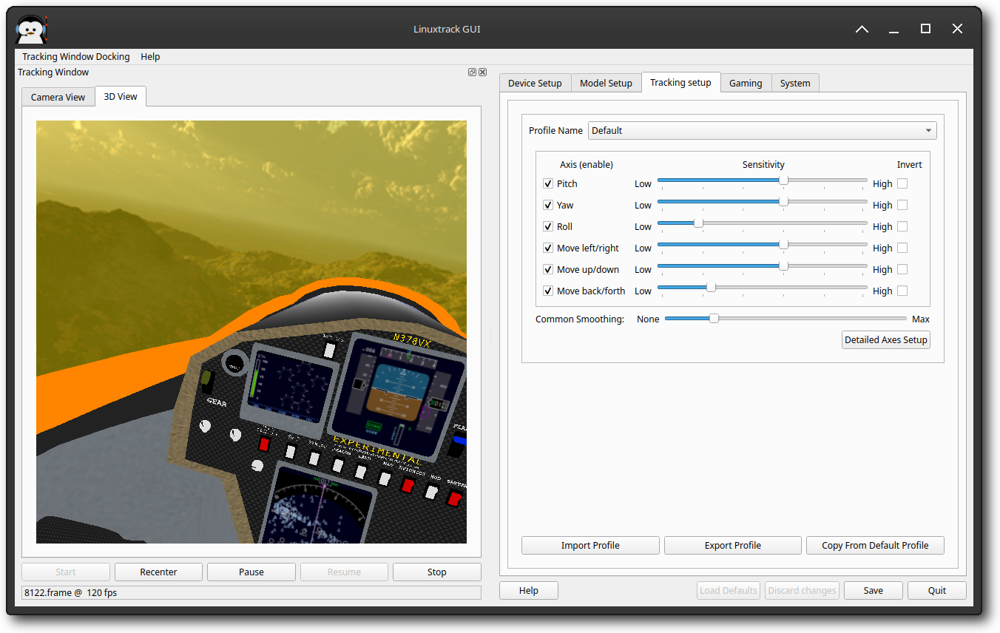
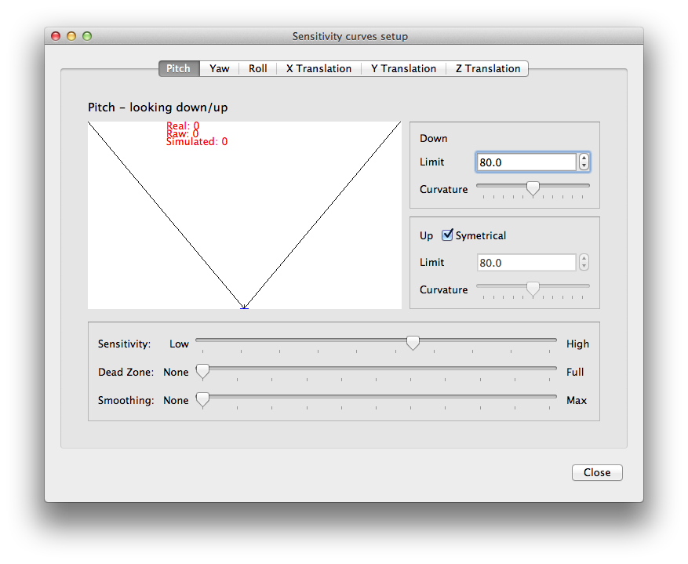

# Tracking Setup

When you have the tracking device and model set up, then you can proceed to the tracking customization.

Here you can set sensitivities, dead zones, nonlinearities and the amount of filtration for each axis separately; you can also turn unwanted axes off, specify limits of each axis and so on... All this can be done separately for each target program/game.

## Default profile

The Default profile is quite special - when an unknown game/program is run for the first time, the Default profile is copied over as a base of the new profile.

## General setup

Make sure you have selected the desired profile. Controls in the Tracking setup pane lets you do the following:

- Check-box in the front allows you to enable/disable an axis.

- Sensitivity controls allow you to change control responsiveness - the higher the sensitivity is, the more responsive the particular axis will be.

- Check-box on the right side allows you to invert the axis response.

- **Common smoothing** slider allows you to set the amount of smoothing applied to all axes.

- **Detailed axes setup** button opens a dialog allowing you to set all aspects of all the axes.

- **Import profile** button imports all settings in the current profile from a file.

- **Export profile** button exports current profile to a file.

- **Copy from Default Profile** copies Default profile setup to the current profile.

All the controls have immediate effect on the tracking, so you can directly see the impact of the change. Also note, that while it is possible to run ltr\_gui in parallel with a client program/game, it is not recommended. The tracking does work without the GUI running, unlike other popular alternatives (NP, FreeTrack, FaceTrack NoIR...).

## Detailed axes setup

When **Detailed axes setup** button is pressed, new dialog pops up allowing you to set all aspects of all axes.

On the left side you can see a visualization of the current axis and its setup. For both halves of an axis you can set an in-game limit of an axis and the curvature (nonlinearity) of the axis. There is a **Symmetrical** check-box that allows you to unchain those halves and set each one separately.

You can also set the axis sensitivity, dead-zone and the amount of additional filtration.

The higher the sensitivity is, the smaller head movement will be necessary for tracking. Just be careful not to set it too high - it might result in a stiff neck, and other problems.

Dead-zone allows you to specify size of the region around the center position, where the output is ignored.

Smoothing slider can be used to give the particular axis additional amount of smoothing.

