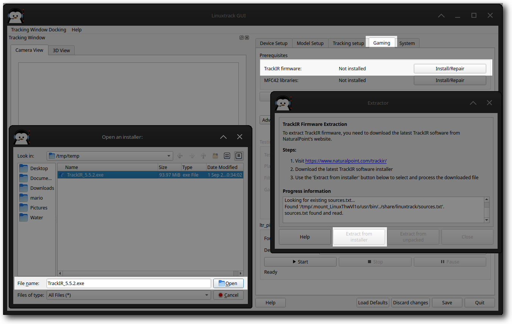
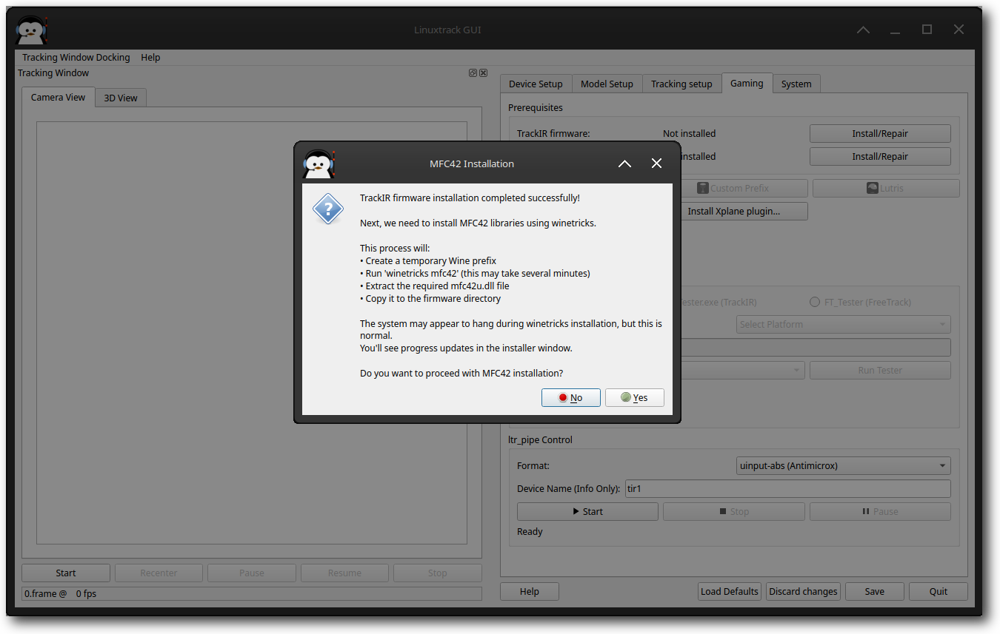
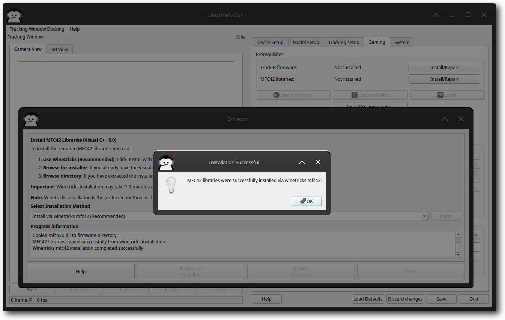

# TrackIR Firmware and Wine Integration Setup

Some NP devices (TrackIR4+ and SmartNav4) require a firmware that has to be loaded each time the device is started. Also the Linuxtrack-Wine bridge utilizes some informations contained in the package (the infamous poetry, list of supported games along with their IDs and keys for the "enhanced" interface). The firmware is extracted using Wine from the TrackIR windows package downloaded directly from NP.

## Firmware and MFC42 Extraction Process

LinuxTrack X-IR provides a streamlined process for extracting TrackIR firmware and MFC42 libraries required for Windows game compatibility. The process is divided into several steps with visual guidance.

### Step 1: Initial Setup and TrackIR software installation

**Action Required:** The system checks for existing firmware and prepares the extraction environment.

*What happens:* LinuxTrack X-IR verifies that the firmware directory exists and is accessible. If this is your first time running the application, you'll see this initial setup screen.

**Action Required:** Download the latest TrackIR software from NaturalPoint's website.

*Instructions:* Visit [https://www.naturalpoint.com/trackir/](https://www.naturalpoint.com/trackir/ "https://www.naturalpoint.com/trackir/") and download the latest version of the TrackIR software installer (usually TrackIR 4.2.x or 5.x).

- **Browse for installer** - If you have the installer file

- **Browse directory** - If you have extracted the installer manually

### Step 2: Continue the installation from the TrackIR.exe using automated process using Wine

[Step 2: Complete the installation from NaturalPoint exe file](images/firmware_step2.png)

### Step 3: Continue Installation Method

[Step 3: Follow the instructions from the installer](images/firmware_step3.png)

**Action Required:** Choose agree and continue the installation.

### Step 4: mfc42.dll and mfc42u.dll Installation Process

**Action Required:** Install MFC42 libraries using winetricks.

*What happens:* The system creates a temporary Wine prefix, runs winetricks mfc42 installation, and extracts the required mfc42u.dll file. This process typically takes 1-3 minutes.

**Action Required:** If the default method fails, select an alternative download source.

*Available sources: see scrrenshot below*

- **Install via winetricks mfc42 (Recommended)** - Uses winetricks for reliable installation

- Install via winetricks vcrun6

- VS6SP6.EXE - Visual Studio 6 Service Pack 6

- VC6RedistSetup\_deu.exe - German Visual C++ 6 redistributable

- vcredist\_x86.exe - Standard redistributable

- Download from alternative sources - You can download-extract and browse to the extracted directory

Once selected, the system automatically selects the appropriate extraction method (cabextract vs Wine installer) and verifies downloads with SHA256 checksums.

### Step 5: MFC42 Installation Options

[Step 5: Alternative MFC42 installation for Arch Linux](images/mfc42_install_step1.png)

### Continue with MFC42 Installation Steps

#### Step 2: Winetricks Automated Installation Progress

**Action Required:** Wait for the installation to complete.

*What happens:* The system may appear to hang during winetricks installation, but this is normal. The process includes creating a Wine prefix, running the MFC42 installer, and copying files to the firmware directory.

#### Step 3: Installation Completion

[MFC42 Installation Step 3: Completion confirmation](images/mfc42_install_step3.png)

**Action Required:** Confirm successful installation.

*Result:* MFC42 libraries are successfully installed, and you can proceed with Wine Bridge installation for your gaming platforms.

#### Step 3: Installation Completion

[Installation completed](images/firmware_step5_mfc42_step4.png)

**Action Required:** Confirm successful installation.

*Result:* MFC42 libraries are successfully installed, and you can proceed with Wine Bridge installation for your gaming platforms.

## Manual Installation Alternative

If you encounter any difficulties using the automated methods, you can try to install the components manually:

**Manual Wine Installation:** Install the TrackIR driver using Wine or on a Windows machine, then copy the result to your Linux system.

**Manual Extraction:** Use the **Extract from unpacked** option, browse to the directory containing the NP software (e.g., ~/.wine/drive\_c/Program\ Files/NaturalPoint/TrackIR5), and press **Open** to begin extraction.

## Technical Information

The extracted files are stored in:

`~/.config/linuxtrack/tir_firmware`

**Extracted files include:**

- **poem1.txt** - First haiku verse (DLL signature)

- **poem2.txt** - Second haiku verse (Application signature)

- **gamedata.txt** - List of TrackIR enhanced games with IDs

- **sn4.fw.gz** - SmartNav4 firmware

- **tir4.fw.gz** - TrackIR4 firmware

- **tir5.fw.gz** - TrackIR5 firmware

- **tir5v2.fw.gz** - TrackIR5 rev 2 firmware

- **mfc42u.dll** - Microsoft Foundation Classes library

- **mfc42.dll** - MFC42 library (symlinked)

## Why This Process?

The extraction process may seem complex, but there are important reasons for this approach:

**Technical Necessity:** NaturalPoint's firmware and MFC42 libraries are required for TrackIR functionality and Windows game compatibility. These components contain proprietary information needed for proper device operation and game integration.

**Security:** Alternative download sources include SHA256 verification to ensure file integrity, especially important for Arch Linux users without wine32 support.

**Compatibility:** The winetricks method ensures proper installation and compatibility across different Linux distributions and Wine versions.

## Troubleshooting

**If installation hangs:** This is normal during winetricks operations. Wait 2-3 minutes before checking if the process is still active.

**If download fails:** Try alternative download sources or manually download and use the "Browse for installer" option.

**If extraction fails:** Ensure you have sufficient disk space and Wine is properly installed. Check the progress log for specific error messages.

**For Arch Linux users:** The alternative sources (VS6SP6.EXE, VC6RedistSetup\_deu.exe) are specifically provided for systems without wine32 support.

## Why so complicated?

Maybe you wander, why is the whole thing that complicated, or why to download ~20MB package instead of 100KB one?

There are two main reasons that led to this decision:

The first one is the neglect from the NP's side - I asked couple of relatively simple questions (e.g. what is their take on Linuxtrack in Wine, ...), and after a year of waiting without any real answer, I came to a conclusion that this is not a way to go.

The second reason was their attempt to impose artificial limitations on the Linuxtrack itself in order to grant me a permission to use SmartNav 4 firmware; they asked for disabling SmartNav4 functionality on Mac OS, so people couldn't use Linuxtrack to emulate a mouse. Besides of being technically impossible to do (how a library can check what it is being used for), it would be completely against the Linuxtrack's spirit.

For those reasons (and couple of others) I decided to cut all the bonds (they used to host Linuxtrack firmware package in the past - per their own request) and using Wine was the only logical choice. Given the fact, that this step is mostly one time only, I hope the inconvenience level is not too high.

## Technical informations

The extracted files are in the following path:

~/.config/linuxtrack/tir\_firmware

and it contains the following files:

- **poem1.txt** The first haiku verse - so called DLL signature

- **poem2.txt** The second haiku verse - so called Application signature

- **gamedata.txt** List of TrackIR enhanced games along with their IDs

- **sn4.fw.gz** SmartNav4 firmware

- **tir4.fw.gz** TrackIR4 firmware

- **tir5.fw.gz** TrackIR5 firmware

- **tir5v2.fw.gz** TrackIR5 rev 2 firmware

The haiku verses are used by most games to verify that there is a TrackIR software on the other side. It was used to prevent other programs from emulating the interface (most notably FreeTrack). The claim was based on the fact, that those strings contain NP's trademark and they are copyrighted. My belief is, that since most games refuse to work without it, it is a part of the interface and therefore not copyright-able in order to provide means of interoperability. Also Fair use should be applicable in this case.

The gamedata.txt list is extracted from file sgl.dat; the file is encrypted using RC4 stream cipher, using first 5 bytes in MD5 hash of string "NaturalPoint" as a key. The payload is XML, containing data on supported games, of which the only relevant part is a game ID, its name and for games using the "enhanced" interface there are communication keys. The Linuxtrack-Wine bridge uses this info to determine game's name when passed its ID and the keys to emulate the enhanced interface when necessary.

