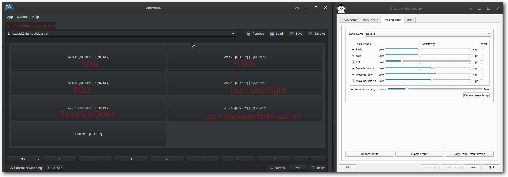
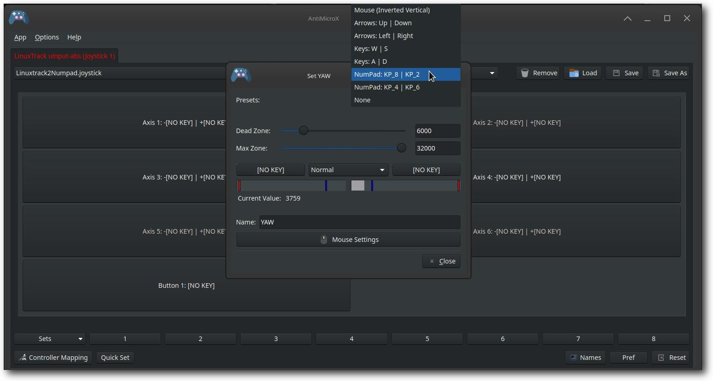

# Gaming Tab

The Gaming tab provides comprehensive gaming platform integration for LinuxTrack X-IR, allowing you to set up head tracking for various gaming platforms including Steam Proton, Lutris, and custom Wine prefixes. This centralized interface manages all gaming-related functionality.

## Prerequisites Section

Before setting up Wine Bridge integration for any gaming platform, ensure these prerequisites are met:

### TrackIR Firmware

**Status:** Shows "Installed" when TrackIR firmware is properly extracted and available.

**Install/Repair Button:** Click this button to install or repair TrackIR firmware if it's missing or corrupted. This will launch the [TrackIR Firmware/Wine Integration Setup](extractor "TrackIR Firmware/Wine Integration Setup") process.

### MFC42 Libraries

**Status:** Shows "Installed" when MFC42 libraries are properly installed for Windows game compatibility.

**Install/Repair Button:** Click this button to install or repair MFC42 libraries if they're missing. These libraries are required for most Windows games to work with TrackIR.

## Gaming Platform Installation

Once prerequisites are met, you can install Wine Bridge for your preferred gaming platform:

### Steam (Proton)

**Button:** "Steam (Proton)" - Installs Wine Bridge for Steam games running through Proton.

**What it does:** Automatically detects your Steam installation and Proton versions, then installs Wine Bridge to the appropriate location for seamless head tracking in Steam games.

### Lutris

**Button:** "Lutris" - Installs Wine Bridge for games managed by Lutris.

**What it does:** Detects your Lutris installation and Wine prefixes, then installs Wine Bridge to enable head tracking in Lutris-managed games.

### Custom Prefix

**Button:** "Custom Prefix" - Installs Wine Bridge for custom Wine prefixes not managed by Steam or Lutris.

**What it does:** Allows you to browse and select a custom Wine prefix directory where you want to install Wine Bridge for head tracking support.

### X-Plane Plugin

**Button:** "Install Xplane plugin..." - Installs the X-Plane plugin for native Linux support.

**What it does:** Installs the X-Plane plugin directly to your X-Plane installation directory for native head tracking support without Wine.

### Advanced Options

**Dropdown:** "Advanced..." - Provides additional configuration options for advanced users.

**Options include:**

- Custom Wine prefix selection

- Manual Wine Bridge installation paths

- Advanced debugging options

- Custom game detection settings

## Testing Section

The Testing section allows you to verify that Wine Bridge is working correctly with your games:

### Tester Selection

**Radio Buttons:**

- **"Tester.exe (TrackIR)"** - Uses the TrackIR tester application (recommended for most games)

- **"FT\_Tester (FreeTrack)"** - Uses the FreeTrack tester for games that support FreeTrack protocol

### Platform Selection

**Dropdown:** "Select Platform" - Choose the gaming platform you want to test.

**Available platforms:**

- Steam (Proton)

- Lutris

- Custom Wine Prefix

- Native Linux (X-Plane)

### Game Filtering

**Text Field:** "Type to filter games..." - Enter text to filter the list of available games.

**Purpose:** Helps you quickly find specific games in large libraries by typing part of the game name.

### Game Selection and Testing

**Dropdown:** "Game" - Select the specific game you want to test.

**Button:** "Run Tester" - Launches the selected game with the tester application to verify head tracking functionality.

## Linuxtrack Server Section

The Linuxtrack Server section controls the head tracking data output format and server status:

### Output Format

**Dropdown:** "Format" - Select the output format for head tracking data.

**Available formats:**

- **"uinput-abs (Antimicrox)"** - Absolute input format compatible with Antimicrox and similar tools

- **"uinput-rel"** - Relative input format for mouse emulation

- **"joystick"** - Joystick input format for games that support joystick head tracking

- **"freetrack"** - FreeTrack protocol for compatible games

### Device Information

**Text Field:** "Device Name (Info Only)" - Shows the current device name (e.g., "tir1").

**Purpose:** Displays the virtual device name that will be created for head tracking input.

### Server Controls

**Buttons:**

- **"Start"** - Starts the Linuxtrack server to begin head tracking data output

- **"Stop"** - Stops the Linuxtrack server

- **"Pause"** - Temporarily pauses head tracking data output

### Server Status

**Status Message:** Shows the current server status (e.g., "Ready", "Running", "Paused", "Stopped").

**Purpose:** Provides real-time feedback about the Linuxtrack server state.

## Server Workflow Example

Here's a comprehensive example workflow for setting up head tracking using the Linuxtrack server with various gaming scenarios:

### Linuxtrack to AntiMicroX Integration

LinuxTrack includes a powerful feature that allows you to use head tracking with games that don't natively support TrackIR by using AntiMicroX to translate head movements into keyboard, mouse, or joystick inputs.

#### Prerequisites for AntiMicroX Integration

**Install AntiMicroX:** Most Linux distributions include AntiMicroX in their software repositories. Install it using your package manager or visit [https://antimicrox.github.io/](https://antimicrox.github.io/ "https://antimicrox.github.io/") for more information.

#### Configure Linuxtrack Server

**Launch Linuxtrack GUI:** Start the Linuxtrack GUI application first.

**Set Output Format:** In the Gaming Tab, set the Format to "uinput-abs (Antimicrox)" in the Linuxtrack Server section.

**Start Server:** Click "Start" in the Linuxtrack Server section to begin joystick emulation mode.

#### Configure AntiMicroX

**Launch AntiMicroX:** Start AntiMicroX. You should see "LinuxTrack uinput-abs (Joystick 1)" appear in the device list.

**Axis Mapping:** AntiMicroX will recognize the following Linuxtrack axes:

- **Axis 1:** Yaw (left/right head movement)

- **Axis 2:** Pitch (up/down head movement)

- **Axis 3:** Roll (head tilt)

- **Axis 4:** Move left/right

- **Axis 5:** Move up/down

- **Axis 6:** Move backwards/forwards

#### Gaming Examples

**Jane's Longbow 2 (PCEM):** Map Yaw and Pitch axes to number keypad keys (KP\_4/KP\_6 for yaw, KP\_8/KP\_2 for pitch). Adjust head movement speed in the game's ca.ini file.

**MechWarrior 2 (DOSBox):** Map Pitch and Yaw axes to mouse movement for torso view and targeting reticle control.

**Flight Simulators:** Map axes to joystick inputs for realistic flight control.

#### AntiMicroX Configuration Tips

**Dead Zone:** Set appropriate dead zones to prevent unwanted movement from small head motions.

**Max Zone:** Adjust maximum zone to control the sensitivity of head movements.

**Profiles:** Save different profiles for different games to quickly switch between configurations.

**Axis Configuration:** Click on any axis to open the configuration dialog. Here you can set dead zones, maximum zones, and map the axis to keyboard keys, mouse movements, or other joystick inputs. The example shows YAW axis configuration with number keypad mapping (KP\_8/KP\_2 for up/down movement).

## Troubleshooting

**If prerequisites show "Not Installed":** Click the "Install/Repair" buttons to install missing components.

**If Wine Bridge installation fails:** Check that Wine is properly installed and your gaming platform is correctly detected.

**If testing fails:** Ensure the Linuxtrack server is running and the correct output format is selected.

**If games don't detect head tracking:** Verify that the game supports TrackIR or FreeTrack, and that Wine Bridge is properly installed for your platform.

## Advanced Configuration

For advanced users, the Gaming tab provides additional configuration options through the "Advanced..." dropdown. These options allow for custom Wine prefix management, manual installation paths, and debugging settings that can help resolve complex setup issues.

For detailed information about TrackIR firmware extraction and Wine integration, see the [TrackIR Firmware/Wine Integration Setup](extractor "TrackIR Firmware/Wine Integration Setup") guide.

