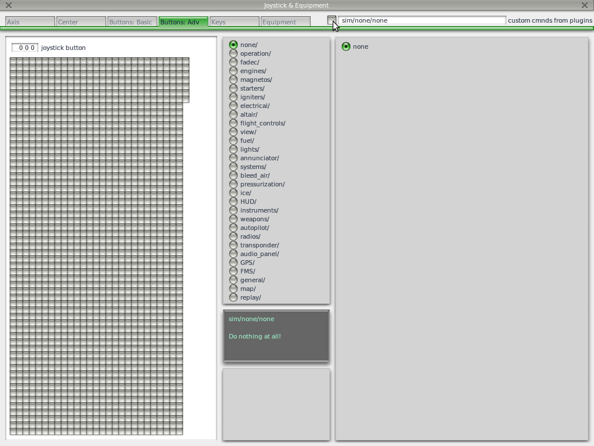
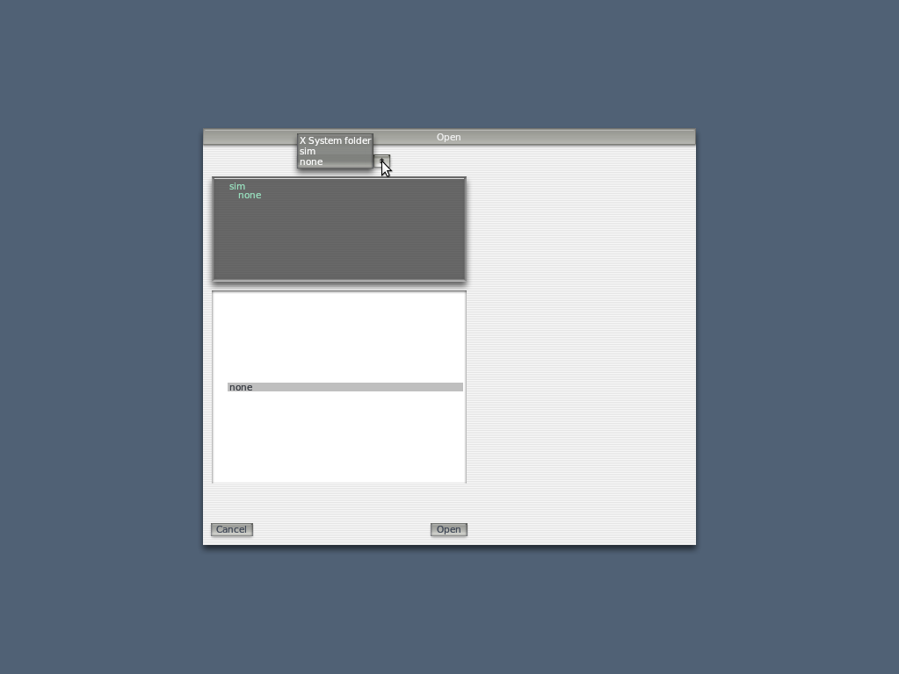
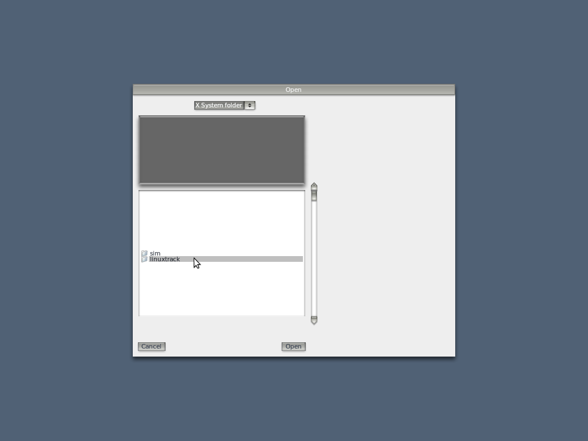
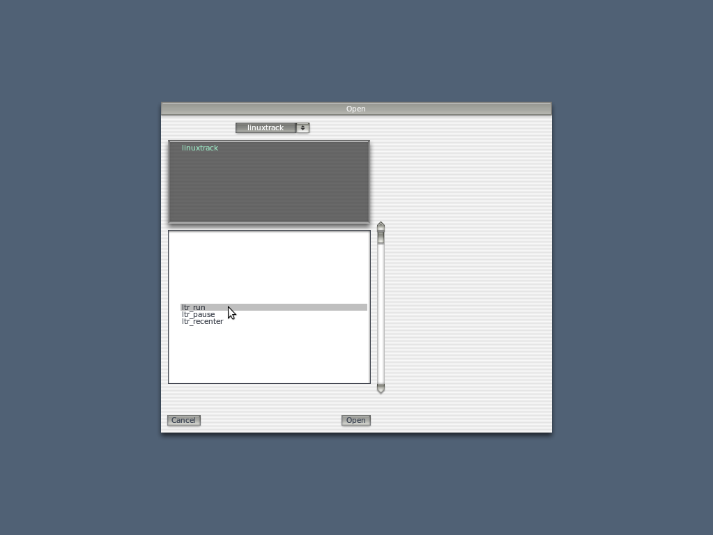
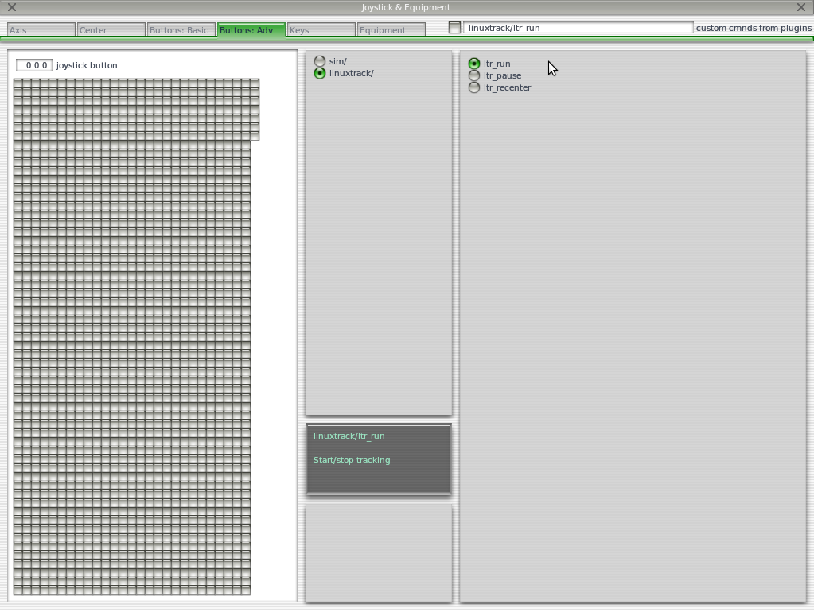
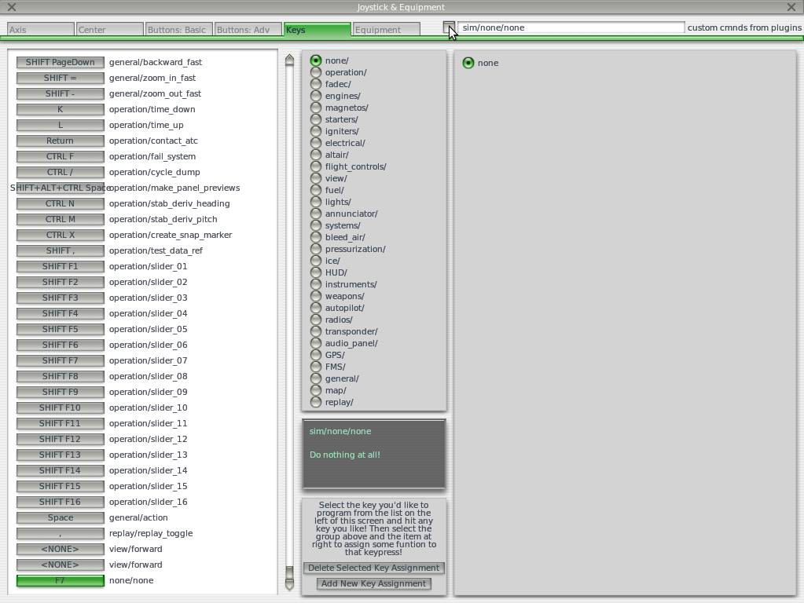

# X-Plane Plugin Setup

When you have the X-Plane plug-in installed according to the [X-Plane plug-in
installation](misc#XplInstall "X-Plane plug-in
installation"), a short setup is needed in order to use it - keys or joystick buttons have to be bound
in order to start, stop, recenter and pause the
tracking. Please note, that the setup of tracking parameters (sensitivities, ...) is done in the Linuxtrack GUI,
X-Plane plug-in doesn't have any means to do that.

## Joystick buttons setup

Joystick buttons are setup using Buttons : Adv pane in the Joystick & Equipment window, that is accessible
through Settings / Joystick, Keys & Equipment menu in X-Plane.

Press the desired joystick button, then check the check-box next to the tabs (under the mouse pointer
in the screen-shot above) and the following dialog will appear.

Click the combo-box in the upper part of the dialog and select X System folder.

Select the linuxtrack line in the lower part of the dialog.

Finally select the desired command (ltr\_run, ltr\_pause or ltr\_recenter).

Repeat those steps for other actions (pause, recenter) and when done, just close the window and now you
can control Linuxtrack using the new bindings.

## Keyboard bindings setup

Keyboard bindings are setup pretty much in the same way - use Keys pane in the Joystick & Equipment window,
that is accessible through Settings / Joystick, Keys & Equipment menu.

When you create or select a key binding, use the check-box next to the tabs and continue the same way as for
joystick bindings.

You can also press Add new key assignment button in the middle bottom, that will create new key position -
just press the newly created button and then press the key (or key combination) that you want to assign to it.
Then again select the desired binding.

## Pilot View interface

Recent Linuxtrack versions contain an interface, allowing Linuxtrack's X-Plane plug-in to communicate with
Pilot View plug-in(version 1.7+) by Sandy Barbour.

To enable the Pilot View interface, open the Pilot View.ini file (located in Resources/plugins/Pilot View
directory in your X-Plane installation folder) in your favorite text editor and add a
line "EnableExternalData = 1" to the CONFIG section, so the result reads like this:

**[CONFIG]
EnableExternalData = 1
AutoStart = 0
EngineVibration = 1
...**

When done, start X-Plane and start the tracking - now, when Pilot View plug-in is enabled, the tracking should work.

### Troubleshooting Pilot View interface

Should you encounter any problems, please follow these steps:

- Verify you have Pilot View 1.7 or higher (see the title-bar of its Config window)

- If you installed Pilot View plug-in before May 19th 2013, please download the fresh version and try
  again (don't forget the required modification of the .ini file!)
- If you didn't reinstall the Linuxtrack plug-in, please do so in the ltr\_gui (Misc. pane)

- In the plug-ins menu inside X-Plane, open Linuxtrack and Linuxtrack Setup menu -
  there should be a line saying: "Pilot View plug-in found, channeling head-tracking data through it!".

Should you encounter any problems getting this to work, please contact me first, so I can determine where
the problem is.
